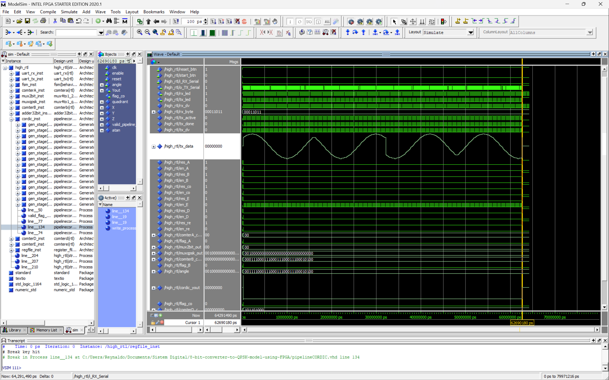

# 8-bit to QPSK Signal Converter using FPGA

## 1. Overview

This project implements a fully digital system on an FPGA to convert an 8-bit parallel data input into a QPSK (Quadrature Phase-Shift Keying) modulated baseband signal. The system is designed as a modular datapath controlled by a central Finite State Machine (FSM).

The core of the design uses a CORDIC (COordinate Rotation DIgital Computer) module to generate sine waveform samples based on phase inputs. The final output is a stream of digital values representing the modulated waveform, ready to be sent to a Digital-to-Analog Converter (DAC).

## 2. System Architecture and Datapath

The hardware design is composed of several interconnected modules, orchestrated by a central FSM. The data flows from the UART receiver, through the symbol mapping and phase generation stages, into the CORDIC core for waveform synthesis, and is finally stored in a register before being transmitted by the UART transmitter.

## 3. Simulation and Verification

The design was verified using ModelSim. The simulation waveform below shows the successful generation of the final serial output (`o_TX_Serial`) based on the input data and control signals.

## 4. FPGA Implementation

The VHDL code was synthesized into an RTL (Register-Transfer Level) schematic, which represents the actual logic gates and registers that will be implemented on the FPGA.

### RTL Schematic

### Pin Assignment
The top-level ports of the design were mapped to the physical pins of the FPGA for hardware implementation.

## 5. Application and Realization

This design is a fundamental building block for digital communication systems. To realize a true analog QPSK signal, the digital output from the FPGA should be connected to a Digital-to-Analog Converter (DAC), followed by a low-pass filter to smooth the signal. The resulting analog waveform demonstrates the characteristic phase shifts of QPSK modulation.

